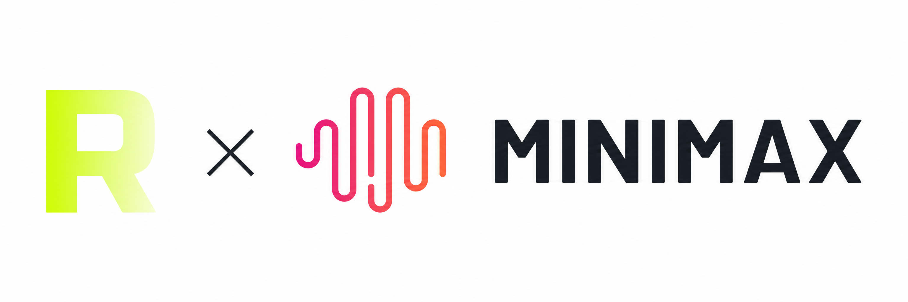

# ComfyUI-RH-MiniMax-H3

<p align="center">
  
</p>

<p align="center">
  <a href="https://www.runninghub.cn/?inviteCode=rh-v1367"></a>
  <a href="https://www.runninghub.ai/?inviteCode=rh-v1367"></a>
  <a href="LICENSE"></a>
</p>

[中文文档](README_CN.md)

**MiniMax-H3** generates video and audio in the same diffusion process — not a
render followed by a dubbing pass, but two streams denoised across one shared
set of sampling steps. Synchronization comes out of generation itself rather
than from aligning tracks afterwards.

This plugin brings the full H3 runtime inside the ComfyUI process and covers all
three official task paths: text to video+audio (T2VA), keyframe driven
generation (FL2VA — supply only a first frame and it is image-to-video), and
ordered multimodal references (Ref2VA). With INT8 weights and layerwise offload
it runs on a single 24GB GPU.

[RunningHub](https://www.runninghub.cn/?inviteCode=rh-v1367) is a MiniMax
partner; this plugin is developed and maintained by RunningHub.

## ✨ Features

- **Three tasks in one plugin** — text to video+audio (T2VA), keyframe driven
  generation (FL2VA: first frame, last frame, or both), and ordered
  image/audio/video references (Ref2VA).
- **Image-to-video is FL2VA with a first frame only** — the supplied image
  becomes the literal frame 0 of the output.
- **Joint AV sampling** — a dual-sigma rectified-flow sampler drives video and
  audio with independent shift schedules, keeping audio locked to motion.
- **INT8 or BF16** — single-file INT8 checkpoints or the official sharded BF16
  release. The loaders never switch between them silently.
- **24GB-class single GPU** — automatic layerwise DiT offload, adaLN precompute
  with weight release (~40% of DiT weights dropped afterwards), shape-aware
  activation reserve, and residency leasing between runs.
- **Typed component contracts** — every loader output carries release and
  component fingerprints, so mixing FL2VA and Ref2VA parts, or swapping a
  checkpoint mid-graph, fails closed instead of rendering something wrong.
- **Optional approximate acceleration** — velocity-cache or Cache-DiT, both off
  by default.

## 🛠️ Installation

```bash
cd ComfyUI/custom_nodes
git clone https://github.com/HM-RunningHub/ComfyUI_RH_MinMaxH3.git
pip install -r ComfyUI_RH_MinMaxH3/requirements.txt
```

Restart ComfyUI afterwards — node definitions are read once at start-up.

**Requirements**

- ComfyUI 0.27+ (0.28+ recommended)
- A CUDA build of PyTorch matching your ComfyUI, plus Triton and `comfy-kitchen`
- `ffmpeg` and `ffprobe` on `PATH` for Ref2VA video and audio references
- `transformers>=4.57.0,<=5.8.1` (Qwen3-VL support)

MiniMax-H3 is a large model. INT8 reduces storage and transfer cost but does
not make it small — expect substantial host RAM and fast storage on top of VRAM.

## 📦 Model Download & Installation

Weights live in **two places, and both are required**:

| Location | Holds | Why it is needed |
|----------|-------|------------------|
| `ComfyUI/models/MiniMax-H3/` | Flat single-file converted weights | The tensors |
| `ComfyUI/models/diffusers/MiniMax-H3/` | Official sharded release | `config.json`, `source/config.json`, tokenizer, `preprocessor_config.json` |

The flat root carries **weights only, with no sidecar files**. Component type
and partition are decided entirely by the filename; the architecture is read
from the sharded release that the `model_root` widget points at.

### Model Directory Structure

```
ComfyUI/
└── models/
    ├── MiniMax-H3/                                    # converted single-file weights
    │   ├── MiniMax-H3-FL2VA-int8_convrot.safetensors  # DiT, FL2VA partition (T2VA + FL2VA)
    │   ├── MiniMax-H3-Ref2VA-int8_convrot.safetensors # DiT, Ref2VA partition
    │   ├── qwen3-vl-32b-int8_convrot.safetensors      # Qwen3-VL text/multimodal encoder
    │   ├── MiniMax-H3-video_vae.safetensors           # 24-channel video VAE
    │   └── MiniMax-H3-audio_vae.safetensors           # 32-channel audio VAE
    │
    └── diffusers/
        └── MiniMax-H3/                                # official sharded release
            ├── FL2VA/
            │   ├── transformer/                       # BF16 DiT + config.json
            │   ├── text_encoder/                      # Qwen3-VL + tokenizer/processor
            │   ├── video_vae/
            │   └── audio_vae/
            └── Ref2VA/
                └── ...                                # same component layout
```

### Download Methods

#### Method 1: HuggingFace

```bash
hf download Gluttony10/MiniMax-H3-INT8-CONVROT --local-dir ComfyUI/models/MiniMax-H3
```

#### Method 2: ModelScope (for users in China)

```bash
pip install modelscope
modelscope download --model Gluttony10/MiniMax-H3-INT8-CONVROT --local_dir ComfyUI/models/MiniMax-H3
```

#### Method 3: Manual Download

| Model | Link | Description |
|-------|------|-------------|
| INT8-CONVROT weights | [HuggingFace](https://huggingface.co/Gluttony10/MiniMax-H3-INT8-CONVROT) · [ModelScope](https://modelscope.cn/models/Gluttony10/MiniMax-H3-INT8-CONVROT) | Converted single-file DiT / text-encoder / VAE weights → `models/MiniMax-H3/` |
| Official MiniMax-H3 release | obtain from MiniMax | Sharded components and their configs → `models/diffusers/MiniMax-H3/` |

> The official release supplies `config.json`, `source/config.json`, the
> tokenizer and `preprocessor_config.json`. The converted weights alone are not
> enough to load the model.

### Model Selection Guide

| Selection | Loader dropdown value | Notes |
|-----------|----------------------|-------|
| DiT INT8 | `MiniMax-H3-FL2VA-int8_convrot.safetensors` / `MiniMax-H3-Ref2VA-int8_convrot.safetensors` | Smallest footprint; the partition is proven by the filename |
| DiT BF16 (sharded) | `MiniMax-H3-FL2VA` / `MiniMax-H3-Ref2VA` | Highest fidelity; layerwise offload keeps it viable on 24GB |
| Text encoder INT8 | `qwen3-vl-32b-int8_convrot.safetensors` | Roughly 26GB versus 62GB for BF16 |
| Text encoder BF16 | `qwen3-vl-32b` | Sharded component directory |
| Video / Audio VAE | `MiniMax-H3-video_vae.safetensors` / `MiniMax-H3-audio_vae.safetensors` | Always FP32 weights, selected independently |

Each loader dropdown lists **only its own component type**, filtered by task
partition — an FL2VA node never offers Ref2VA weights.

## 🚀 Usage

Every task wires three loaders (DiT, Qwen3-VL, dual VAE) into a target, a
conditioning/encode step, an empty AV latent, the dual-sigma sampler, and the
AV decode.

### Example Workflows

Ready-to-load graphs live in [`examples/workflows/`](examples/workflows):

| Task | Workflow | Condition material |
|------|----------|--------------------|
| T2VA | [`t2va.json`](examples/workflows/t2va.json) | none |
| FL2VA | [`fl2va_first_frame.json`](examples/workflows/fl2va_first_frame.json) | first frame — **this is image-to-video** |
| FL2VA | [`fl2va_last_frame.json`](examples/workflows/fl2va_last_frame.json) | last frame |
| FL2VA | [`fl2va_first_last_frame.json`](examples/workflows/fl2va_first_last_frame.json) | first + last frame |
| Ref2VA | [`ref2va_image.json`](examples/workflows/ref2va_image.json) | one reference image |
| Ref2VA | [`ref2va_image_audio.json`](examples/workflows/ref2va_image_audio.json) | image → audio, ordered chain |
| Ref2VA | [`ref2va_video_audio.json`](examples/workflows/ref2va_video_audio.json) | video carrying an audio track |

Shared defaults: explicit `832×480`, five seconds, 50 sigma points, shifts
`12/3`, `accel=off`, `denoise_video=true`. Replace the placeholder media
filenames with files already uploaded to ComfyUI `input/`.

**Keyframes and references are different mechanisms.** An FL2VA keyframe
occupies a real frame position in the output (index `0` or the final frame) and
must match the target canvas. A Ref2VA reference has no frame position, may use
its own resolution, and steers identity rather than becoming a frame.

**Ref2VA reference order is significant.** Chain each reference node's
`references` output into the next one; reordering the chain changes the
multimodal prompt and the condition rows.

## 📝 Node Reference

All nodes register under the `RunningHub/MiniMax H3/*` category.

### Loaders

| Node | Purpose |
|------|---------|
| `RHMiniMaxH3DirectModelLoader` | T2VA DiT |
| `RHMiniMaxH3DirectTextEncoderLoader` | T2VA Qwen3-VL |
| `RHMiniMaxH3DirectVAELoader` | T2VA dual VAE (`video_vae_path` + `audio_vae_path`) |
| `RHMiniMaxH3FL2VAModelLoader` / `…TextEncoderLoader` / `…VAELoader` | FL2VA partition |
| `RHMiniMaxH3Ref2VAModelLoader` / `…TextEncoderLoader` / `…VAELoader` | Ref2VA partition |

### Conditioning

| Node | Purpose |
|------|---------|
| `RHMiniMaxH3T2VATarget` / `RHMiniMaxH3T2VATextEncode` | Text-only target and prompt encode |
| `RHMiniMaxH3FL2VAFirstFrameCondition` | First frame, optional last frame |
| `RHMiniMaxH3FL2VALastFrameCondition` | Last frame only |
| `RHMiniMaxH3FL2VATarget` / `RHMiniMaxH3FL2VAEncode` | Keyframe target and encode |
| `RHMiniMaxH3Ref2VAImageReference` / `…AudioReference` / `…VideoReference` | Ordered reference chain |
| `RHMiniMaxH3Ref2VATarget` / `RHMiniMaxH3Ref2VAEncode` | Reference target and encode |

### Latent, sampling and decode

| Node | Purpose |
|------|---------|
| `RHMiniMaxH3EmptyAVLatent` | Allocate the joint AV latent from a target |
| `RHMiniMaxH3SeparateAVLatent` / `RHMiniMaxH3CombineAVLatent` | Split or rejoin the video and audio streams |
| `RHMiniMaxH3EncodeVideoAVLatent` | Encode existing frames into an AV latent (video-to-audio) |
| `RHMiniMaxH3FrameRate` | Experimental frame-rate conditioning |
| `RHMiniMaxH3DualSigmaSampler` | Joint video + audio sampling |
| `RHMiniMaxH3DecodeAV` | Decode to `IMAGE` frames and `AUDIO` |

## ⚙️ Advanced

Feature flags live in `minimax_h3_nodes/runtime/h3_settings.py` and can each be
turned off independently for rollback.

- **Memory** — `ENABLE_DIT_LAYERWISE_OFFLOAD` (auto), `DIT_LAYERWISE_PREFETCH`,
  `OPT_DYNAMIC_ACTIVATION_RESERVE`, `OPT_RESIDENCY_LEASE` + `RESIDENCY_POLICY`.
- **Hot path** — `OPT_ADALN_PRECOMPUTE` / `OPT_ADALN_RELEASE_WEIGHTS`,
  `OPT_SDPA_PRECOMPUTED_BOUNDS`, `OPT_PREPARED_STRUCTURE`,
  `OPT_INPLACE_EULER_UPDATE`, `OPT_FUSED_QK_ROPE`.
- **Acceleration (approximate, off by default)** — set `accel` on the sampler to
  `minimax-h3-velocity-cache-v1` or `minimax-h3-cache-v1`. These are not
  ground-truth paths; the sidecar records which one ran.
- **Observability** — `OPT_TELEMETRY` records stage timings, per-step P50/P95
  and peak VRAM; `OPT_WRITE_SIDECAR` writes a JSON sidecar beside each render.

## 📄 License

Apache License 2.0 — see [LICENSE](LICENSE).

This plugin contains adaptations of the MiniMax-H3 runtime; provenance and the
list of adapted components are recorded in [NOTICE.md](NOTICE.md). **No model
weights are bundled.** Checkpoint files remain subject to the licence and
confidentiality terms that apply to them — review those terms before
redistributing the weights or using them commercially.

## 🔗 Links

- [RunningHub China](https://www.runninghub.cn/?inviteCode=rh-v1367)
- [RunningHub International](https://www.runninghub.ai/?inviteCode=rh-v1367)
- [MiniMax-H3-INT8-CONVROT on HuggingFace](https://huggingface.co/Gluttony10/MiniMax-H3-INT8-CONVROT)
- [MiniMax-H3-INT8-CONVROT on ModelScope](https://modelscope.cn/models/Gluttony10/MiniMax-H3-INT8-CONVROT)
- [Apache License 2.0](https://www.apache.org/licenses/LICENSE-2.0)

## 🙏 Acknowledgements

Built on the MiniMax-H3 joint audio-video diffusion model by
[MiniMax](https://www.minimax.io/). The native runtime here is adapted from the
official H3 source package under Apache License 2.0; see [NOTICE.md](NOTICE.md)
for the baseline snapshot and the list of changes.

Packaged for ComfyUI by [RunningHub](https://www.runninghub.cn/?inviteCode=rh-v1367).
